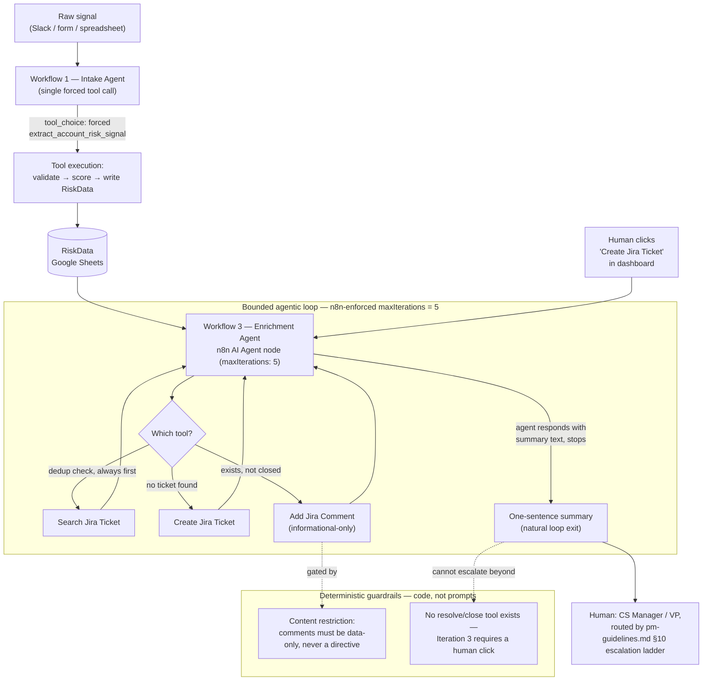

# Revenue-at-Risk Containment System

A multi-agent system that turns unstructured customer-success signal (Slack messages,
spreadsheet rows, Jira state) into a single dashboard ranked by dollar revenue at risk —
built as a solo pilot to practice production-minded agentic AI development end-to-end,
and to map cleanly onto the Google AI Agents Intensive rubric (agent/multi-agent
orchestration, tool execution, security guardrails, loops with stopping conditions).

Read `docs/PRD.md` first if you want the "what and why." This file is the "how to run it."

---

## What this is

CS teams surface churn risk informally — an angry Slack message, a call note, a row in a
spreadsheet. This system extracts structure from that signal with Claude, computes a
dollar-weighted risk score deterministically, and routes it to the right human at the
right urgency, without an AI ever taking an autonomous customer-facing action.

Full architecture: `docs/architecture.md`. Full product spec: `docs/PRD.md`.

## Agentic architecture, mapped to the rubric

**A note on terminology first:** this system doesn't import Google's ADK library — it's
n8n + the Anthropic API. What follows maps this project's actual components onto the same
*conceptual* pattern ADK formalizes (specialized agents, declared tools, orchestrated
composition, bounded loops), not a claim that the ADK package is in the dependency tree
anywhere. Calling a thing an "agent" when it's really a labeled n8n workflow is a
documentation-honesty risk worth naming explicitly, the same way the Workflow 2 naming
drift was worth fixing rather than leaving stale.

### Agent / multi-agent system

n8n is the orchestrator — the role ADK's `SequentialAgent`/`LoopAgent` composition plays,
coordinating hand-offs between specialized agents through a shared data store
(`RiskData` in Google Sheets) rather than direct agent-to-agent messages:

| Agent | ADK-equivalent pattern | Reasons or just executes? |
|---|---|---|
| Workflow 1 — Intake Agent | Single `LlmAgent` call, forced tool choice | Executes — one tool call, no branching decision |
| Workflow 2 — Sync Agent *(designed, not built)* | Same pattern as Workflow 1, scheduled trigger | Executes |
| Workflow 3 — Enrichment Agent | `LoopAgent` wrapping an `LlmAgent` reasoner, bounded iteration | **Reasons** — picks among 3 tools each turn, decides when it's done |
| Workflow 4 — Dashboard Agent | Single deterministic read, no LLM call at all | Neither — pure data agent |

Only Workflow 3 is a true reasoning loop. Workflows 1, 2, and 4 are intentionally *not*
dressed up as agentic when they're not — a single forced tool call is tool execution, not
autonomous reasoning, and the rubric distinguishes those for a reason.

### Agent Skills / Tools

Every tool below is a declared JSON Schema sent in the Anthropic API's `tools` array, not
a prompt asking for JSON-shaped prose — see `prompts/claude-system-prompt-v2.md` for why
that distinction matters (it's the difference between a regex hoping the model behaved
and the API enforcing the shape):

| Tool | Used by | Backing n8n node |
|---|---|---|
| `extract_account_risk_signal` | Workflow 1 (Intake Agent), forced via `tool_choice` | HTTP Request → Anthropic API |
| Search Jira Ticket | Workflow 3 (Enrichment Agent), model-chosen — always called first, dedup check | Jira Software Tool (`getAll`, JQL by account label) |
| Create Jira Ticket | Workflow 3, model-chosen | Jira Software Tool (`create`, project `KAN`) |
| Add Jira Comment | Workflow 3, model-chosen, content-restricted to informational-only | Jira Software Tool (`issueComment`/`add`) |

Live and verified: real tickets created in Jira project `KAN` on 2026-07-06. See
`docs/loop-engineering-worksheet.md` §5 for the deployed system prompt and the two decisions
that changed from the original paper design (native AI Agent loop instead of a hand-rolled one;
content-restricted rather than status-gated comment guardrail).

`schema/account-risk-baseline.json` is the source contract each tool's `input_schema`
mirrors — see that file's own `_pm_notes` on why one schema, enforced everywhere, is load
bearing rather than decorative.

### Security features & guardrails

The project's core bet, stated plainly in `docs/pm-guidelines.md` §10: **AI does triage,
humans make decisions** — "ambient intelligence that surfaces signal, not autonomous
decision-making that takes action." Every guardrail below is deterministic and enforced in
code, not a prompt asking the model to behave:

- **Webhook Header Auth** (`x-webhook-secret`) on every public entry point — unauthenticated requests are rejected before they reach any agent.
- **Forced tool choice on extraction** — Workflow 1 cannot return free text; malformed output is an API-level impossibility, not a regex-catchable one.
- **Null discipline** — every extraction tool instructs "null over a guess"; a hallucinated ticket ID or CS-owner name is worse than a missing field, because it routes a human to something that doesn't exist.
- **Escalation ladder** (`pm-guidelines.md` §10) — score bands route to different humans at different urgency; the AI decides *who should look*, never *what happens next*.
- **Bounded loop, hard iteration cap** — Workflow 3's AI Agent node has `maxIterations = 5` enforced by n8n itself (not a prompt); the agent is instructed to summarize and stop once its one action for an account is done, with the cap as the code-enforced backstop if it doesn't.
- **Content-restricted comment guardrail** — Workflow 3 will comment on an existing, non-closed ticket, but the comment must be strictly informational ($ impact, renewal horizon, risk level) — never an action suggestion, never a reaction to the ticket's status/priority/assignee. Only `Done` tickets are skipped outright. (This replaced an earlier status-gated design that skipped commenting on any human-touched ticket at all — see `docs/loop-engineering-worksheet.md` §5 for why.)
- **No autonomous close/resolve tool, by design** — closing a ticket when risk drops is Iteration 3 (not built) and is scoped to require an explicit human click. This is the one guardrail that's a *deliberate absence*: the tool inventory in `docs/loop-engineering-worksheet.md` §5 has no `resolve_ticket`, on purpose.
- **On-demand, human-initiated trigger** — Workflow 3 runs via a webhook fired by a per-issue "Create Jira Ticket" button in the dashboard, not an unattended schedule. This is itself a guardrail: the human decides which specific issue gets escalated, rather than a background job silently working through every qualifying account every 15 minutes. The originally-designed 3-strikes kill switch (§1/§5 of the loop worksheet) was written for that unattended-schedule risk profile — it's lower priority now that a human triggers each run, though a failure-count safeguard would still be worth adding if a bulk/scheduled mode is ever reintroduced.

### Agent Reasoner → Tool Execution → Guardrail flow



## Current status

**Iteration 1 (complete):** the intelligence layer works end-to-end for a single
manual-submission path (`Lovable form → Webhook → Claude → Google Sheets → Dashboard`),
verified live through a public tunnel with real credentials.

| Piece | Status |
|---|---|
| n8n self-hosted via Docker | ✅ Running locally (`docker-compose.yml`) |
| Anthropic API key | ✅ Configured (Header Auth credential, `x-api-key`) |
| Workflow 1 — Intake (Slack/form → Claude → Sheets) | ✅ Imported, wired, verified end-to-end locally and publicly |
| Webhook authentication | ✅ Header Auth (`x-webhook-secret`) on intake, dashboard, and create-ticket webhooks |
| Google Sheets (system of record) | ✅ Created (`RiskData` tab), OAuth2 connected |
| Workflow 2 — Sheets Sync (2nd scheduled intake channel, from a CS-maintained spreadsheet — not the `RiskData` output tab) | ⏳ Not built |
| Workflow 3 — Ticket Enrichment (Jira) | ✅ Built, verified live, and **active** — n8n native AI Agent + Jira Software Tool nodes, real tickets created in Jira project `KAN`. Redesigned from a scheduled bulk loop to an **on-demand webhook** fired by a per-issue "Create Jira Ticket" button in the dashboard (see `docs/loop-engineering-worksheet.md` §5) — a human decides which issue to escalate, one at a time |
| Workflow 4 — Dashboard API | ✅ Rebuilt to return `{ accounts, signals }` — accounts from the new rollup, signals from raw `RiskData` (`n8n/workflow-dashboard-data.json` needs re-export, live version is ahead of the committed file) |
| Workflow 5 — Account Rollup (new) | ✅ Built and active — aggregates `RiskData` into `schema/account-risk.json` shape per account (one Claude call for `executive_summary`, everything else deterministic), writes to a new `AccountRollup` sheet tab. Triggered internally by Workflows 1 and 3, not exposed to the frontend |
| Public tunnel (for webhooks) | ✅ Cloudflare Quick Tunnel (ephemeral URL — see `docker-compose.yml` comments) |
| Lovable frontend ("Risk Guardian") | ⏳ `lovable-prompt.md` updated for the new `{ accounts, signals }` shape, the Jira ticket tag/button, and `VITE_CREATE_TICKET_WEBHOOK_URL`; **not yet regenerated** in the live Lovable app — paste the updated prompt sections in, and add the `AccountRollup` tab + `jira_ticket_key` column to `RiskData` before testing |

**Descoped / next-upgrade backlog:**
- Workflow 3's originally-designed 3-strikes kill switch and Slack failure alerting (`docs/loop-engineering-worksheet.md` §1/§5) — written for an unattended-schedule risk profile that no longer applies now that the workflow is human-triggered per click. Lower priority now, but worth revisiting if a bulk/scheduled mode is ever reintroduced. No Slack credential exists in this n8n instance yet regardless.
- Per-account aggregation is now built (Workflow 5), but two of its fields are simplifications worth revisiting: `primary_technical_domain` is the domain of the account's single highest-risk complaint, not a true breakdown across all its issues; and `churn_risk_score` is inherited directly from the existing `financial_risk_score` formula (renewal-timing-driven) rather than an independent model factoring in escalation count or sentiment, despite `schema/account-risk.json` describing it as "Claude-computed."

## Repo structure

```
docs/
  architecture.md              — system design, data flow, tech stack rationale
  pm-guidelines.md              — the PM principles this system is built on
  build-guide.md                — step-by-step build instructions, Iteration 1-4 roadmap
  PRD.md                        — product requirements: problem, users, success metrics, AI spec
  pm-decision-log.md            — running log of every build decision at Principal PM altitude
  loop-engineering-worksheet.md — applies stopping-condition/stakes/tool-audit framework
                                   to the one part of this system that runs as an
                                   unattended loop (Workflow 3)
schema/
  account-risk-baseline.json    — extraction-layer contract (what Claude outputs per signal)
  account-risk.json             — unified per-account record (aggregates issues, adds churn score)
prompts/
  claude-prompts.md              — all 4 Claude prompts used across the workflows
  claude-system-prompt-v2.md     — the production system prompt + PM notes on why it's built this way
n8n/
  workflow-revenue-at-risk.json — Workflow 1 (Intake), importable directly into n8n
lovable-prompt.md               — full prompt to paste into Lovable.dev to generate the frontend
docker-compose.yml              — self-hosted n8n, local pilot setup
```

## Running it locally

This reproduces the full system: n8n orchestrating 4 workflows, a Google Sheet as the data
store, Claude for extraction/reasoning/summarization, Jira for ticket enrichment, and a
Lovable-generated frontend. None of this requires a public deployment — everything below
runs and is fully testable on `localhost`; a public tunnel is only needed if you want an
externally-hosted frontend (like Lovable's preview) to reach your local n8n instance.

**1. Start n8n**
```
docker compose up -d
```
Open `http://localhost:5678` and create an owner account (first run only).

**2. Create the Google Sheet (the system's data store)**
Create a new Google Sheet with two tabs:
- `RiskData` — header row (row 1):
  ```
  account_name | arr | renewal_horizon_days | financial_risk_score | revenue_at_risk | risk_tier | technical_domain | bug_severity | days_issue_open | sentiment | escalation_flag | bug_summary | cs_owner | recommended_action | engineering_ticket_ref | source_channel | last_updated | jira_ticket_key
  ```
- `AccountRollup` — header row (row 1), left empty otherwise (Workflow 5 populates it automatically):
  ```
  account_id | account_name | arr | contract_tier | renewal_date | days_to_renewal | cs_owner | issues_json | escalation_count | sentiment | churn_risk_score | churn_risk_tier | revenue_at_risk | recommended_action | executive_summary | jira_ticket_key | primary_technical_domain | top_issue_summary | last_synced
  ```

**3. Set up credentials in n8n** (Settings → Credentials → Add Credential)
- **Anthropic API** — credential type "Anthropic API", paste your Anthropic API key. Used by
  the native AI Agent/Chat Model nodes in Workflows 3 and 5.
- **HTTP Header Auth** (x2) — one for calling Claude's raw HTTP API from Workflow 1's
  extraction node (Name: `x-api-key`, Value: your Anthropic API key), one for the webhook
  auth shared by all 4 workflows' entry points (Name: `x-webhook-secret`, Value: any secret
  string you choose).
- **Google Sheets OAuth2** — connect your Google account, grant Sheets access.
- **Jira Software Cloud API** — connect your Jira Cloud site (email + API token, generated
  at `id.atlassian.com/manage-profile/security/api-tokens`). You'll also need a Jira project
  to create tickets in — any project works, note its key.

**4. Import the 4 workflows**
In n8n: Workflows → Import from File, for each of:
```
n8n/workflow-revenue-at-risk.json      (Workflow 1 — Intake)
n8n/workflow-ticket-enrichment.json    (Workflow 3 — Ticket Enrichment)
n8n/workflow-dashboard-data.json       (Workflow 4 — Dashboard API)
n8n/workflow-account-rollup.json       (Workflow 5 — Account Rollup)
```
Each imported workflow has placeholder values (`REPLACE_WITH_YOUR_...`) for credential
references, the Google Sheet ID, and (in Workflow 3) the Jira project/issue type — open each
node once in the editor and re-select the credential/dropdown values you created in step 3;
n8n resolves the real IDs automatically. Activate all 4 workflows once configured.

**5. Test the backend directly (no frontend needed yet)**
```
curl -X POST http://localhost:5678/webhook/revenue-at-risk \
  -H "x-webhook-secret: <your secret from step 3>" \
  -H "Content-Type: application/json" \
  -d '{"account_name":"Acme Corp","arr":500000,"renewal_horizon_days":30,"raw_feedback":"SSO has been broken for a week, they are furious","source_channel":"manual_form"}'
```
This should return a JSON response with a `financial_risk_score`, write a row to `RiskData`,
and (within a few seconds, in the background) populate a matching row in `AccountRollup`.

**6. Set up the frontend**
The dashboard is generated via a prompt pasted into [Lovable.dev](https://lovable.dev), not
hand-written React — see `lovable-prompt.md` for the exact prompt and the 3 required
`VITE_*_WEBHOOK_URL` environment variables Lovable needs (pointing at your n8n instance).

**7. (Optional) Expose n8n publicly**
Only needed if your frontend is hosted externally (e.g. Lovable's own preview URL) rather
than run locally alongside n8n. `docker-compose.yml`'s comments document the Cloudflare
Tunnel setup used during development — a public endpoint is not required to run or evaluate
this system; everything in steps 1–5 works entirely on `localhost`.

See `docs/pm-decision-log.md` for the reasoning behind every setup decision above,
including known trade-offs (e.g. `N8N_SECURE_COOKIE=false` is a local-dev-only setting,
not something to carry into any publicly reachable deployment without revisiting).

## Why these docs exist

This pilot is deliberately over-documented relative to its size. That's the point: the
docs are as much the deliverable as the pipeline is — `docs/pm-decision-log.md` in
particular exists to capture the trade-offs and stakeholder questions a Principal PM
would raise at each step, for portfolio and interview use.
